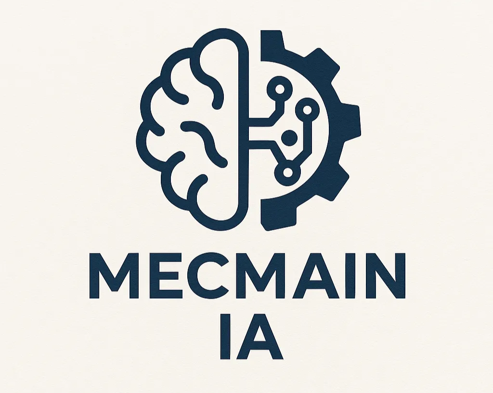

# MecMain IA | StartUp

# MecMain IA | StartUp

**Concepto de MecMain**

**Nombre:** *MecMain IA*

**Origen:** Combinación de “Mec” (abreviación de *mecánica*) y “Main” (de *mantenimiento* y *main* en inglés, que también sugiere centralidad o principal).

---

### 🧠 **Concepto Central**

**MecMain** es una startup enfocada en la transformación digital del mantenimiento mecánico a través de inteligencia artificial. Su propósito es automatizar el entrenamiento del personal técnico y optimizar los procesos de diagnóstico, prevención y ejecución de mantenimientos en cualquier industria que lo requiera, comenzando por el sector automotriz y extendiéndose a otras áreas como maquinaria industrial, aeronáutica, construcción o agrícola.

---

### 🔍 **Propuesta de Valor**

- **Entrenamiento Autónomo:** IA que personaliza y automatiza la capacitación del personal técnico.
- **Optimización Predictiva:** Uso de IA para anticipar fallas y programar mantenimientos preventivos.
- **Escalabilidad Multisectorial:** MecMain puede adaptarse a distintas industrias donde el mantenimiento es crítico.
- **Interfaz Intuitiva:** Plataforma amigable y en español, con un enfoque especial en el mercado latinoamericano.

---

### 🇨🇴 Enfoque en Colombia

- Diseñado para apoyar talleres pequeños y medianos en su transición hacia la digitalización, empoderando a técnicos colombianos con herramientas de nivel mundial.

---

### 🧩 **Aplicaciones**

- Talleres automotrices
- Mantenimiento industrial
- Servicios públicos (transporte, energía)
- Formaciones técnicas SENA / institutos

---
